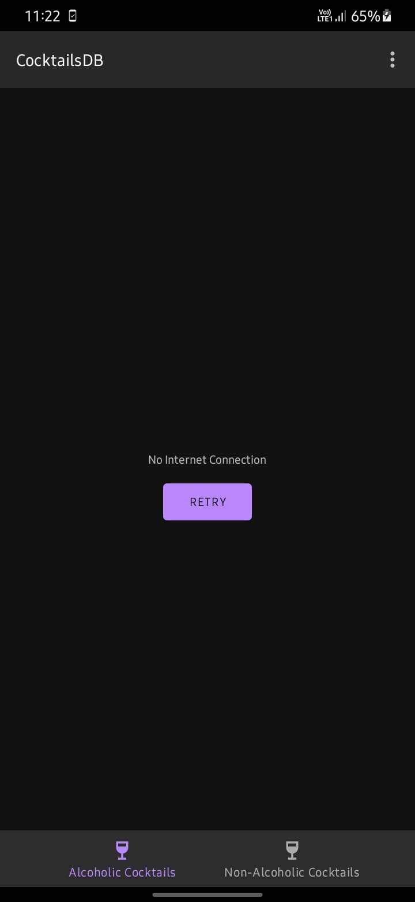

# CocktailDB

- CocktailDB is an application written in Kotlin that allows users to view and search for cocktails from TheCocktailDB API.

## Architecture
- MVVM - Model View View Model. 
- The application has activities and fragments that communicate with their respective viewmodels, which in turn communicate with their respective repositories to fetch data.

## Tech Stack

* Tech-stack
    * [Kotlin](https://kotlinlang.org/) - a cross-platform, statically typed, general-purpose programming language with type inference.
    * [Coroutines](https://kotlinlang.org/docs/reference/coroutines-overview.html) - perform background operations.
    * [Glide](https://github.com/bumptech/glide) - an image-loading library.
    * [Retrofit](https://square.github.io/retrofit/) - to make network calls.
    * [Android KTX](https://developer.android.com/kotlin/ktx.html) - Provide concise, idiomatic Kotlin to Jetpack and Android platform APIs.
    * [AndroidX](https://developer.android.com/jetpack/androidx) - Major improvement to the original Android [Support Library](https://developer.android.com/topic/libraries/support-library/index), which is no longer maintained.
    
    * [Jetpack](https://developer.android.com/jetpack)🚀
        * [Room](https://developer.android.com/topic/libraries/architecture/room) - a persistence library provides an abstraction layer over SQLite.
        * [LiveData](https://developer.android.com/topic/libraries/architecture/livedata) - is an observable data holder.
        * [Lifecycle](https://developer.android.com/topic/libraries/architecture/lifecycle) - perform action when lifecycle state changes.
        * [ViewModel](https://developer.android.com/topic/libraries/architecture/viewmodel) - store and manage UI-related data in a lifecycle conscious way.

## Get started
- Clone the repository using *git clone https://github.com/kev87ian/cocktails.git*
- Wait for the IDE to download all dependencies.
- Tinker with the application as you please.

## Screenshots

## Upcoming Features
- Improving the UI
- Replacing all the activities with a single activity with multiple fragments.

### Contacts
- You can reach me via kelvinian87@gmail.com.
